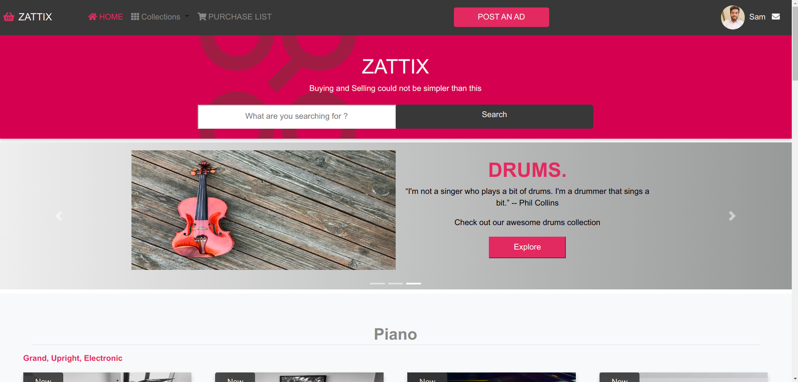

# Newsweek Website

This is Zattix, a musical instruments e-commerce as part of the capstone project from Microverse. This is built using HTML and CSS.

Additional description about the project and its features.

## Built With

- HTML
- CSS
- Bootstrap

## Live Demo

[Live Demo Link](https://samroodali.github.io/zattix-shopping/index.html)

## Requirements

1. Nodejs for the linters and the sass compiler

## Getting Started
To get a local copy up and running follow these simple example steps.

1. Go to https://github.com/SamroodAli/zattix-shopping
2. Click on the code and copy the HTML code.
3. Use terminal to clone this repository on your local machine.
4. Run `git checkout -b your-branch-name`. Make your contributions
5. Push your branch up to your forked repository
6. Open a Pull Request with a detailed description of the development branch of the original project for a review
## Authors

👤 **Author**

- GitHub: [@SamroodAli](https://github.com/SamroodAli)
- LinkedIn: [Samrood Ali](https://www.linkedin.com/in/samrood-ali/)

## 🤝 Contributing

Contributions, issues, and feature requests are welcome!

Feel free to check the [issues page](issues/).

## Show your support

Give a ⭐️ if you like this project!

## Acknowledgments

- Mohammed Awad for the design
- Microverse

## 📝 License

This project is [MIT](lic.url) licensed.
